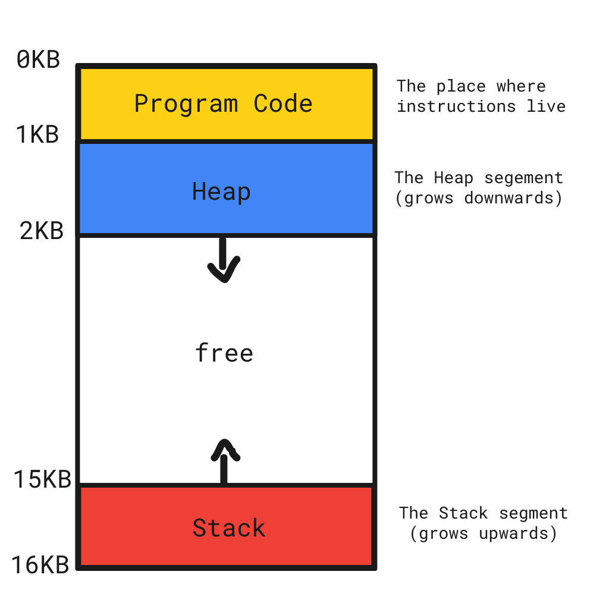

#  Memory 

 - ###  Memory Contain three things 
    
    1. Stack for Static Data Like Array
    2. Heap for Dynamic Data Like Pointer with new Operator
    3. Free Speace to Allow Heap to stretch
    4. Code to Save Short Memory for your code 

<hr/>

- 

<hr/>

# Static Data Location (Stack)
  
- Any Static Data store at Stack as Static data Located and Run at (Comiler Time)
- Like Static Array and Static Variables 
- Stack by default delete every thing affter Run Time 

```c++

 int x = 20; // Static Data Located at Stack and Take 4 bytes

 int y; // Static Data Located at Stack and Take 4 bytes

 int *P_y ; // Static Data Located at Stack and Take 4 bytes or 8 bytes (32/64)

 int arr[5]; // Static Data Located at Stack and Take 20 bytes

 cin >> y;  // Static Data Located at Stack and Take 4 bytes

 int arr [y]; 
 
 // 1. Dynamic Data Located at Heap and we dont know the size of this array 

 // 2. We will see big error as Stack cant Store dynamic data at Compile Time

 // 3. So at this case we need use Heap With Stack

```

# Dynamic Data Location (Heap)

 - To tell our Programm make this data at our Heap we Need Use (new Operator)
 - Any Dynamic Data store at Heap at (Run Time)
 - Like Dynamic Array with Pointer 
 - Heap unfortunately it does not delete stored data automatically so we need use delete Operator to clear our Heap


 
 ```c++

 int y;

 cin >> y;  // Static Data Located at Stack and Take 4 bytes
 
 int *arr = new int[y]; 
 
 // 1. Now we have Dynamic Array created with Heap and Stack 

 // 2. We used Pointer Static Data at Stack to make him refrance to our Firts Element in Dynamic array now he have her Address

 // 3. We used new to tell our programm make this data at our Heap and make it stretch dependent on our variable y
 

 // if we print our arr now it should have the Address of first element in array

 cout << arr;
  // if we print our *arr now it should have the value of first element in array

  cout << *arr; 
  //OR
  cout << arr[0];
  //OR 
  cout << arr[1];
  cout << *(arr+1);
  
```
  